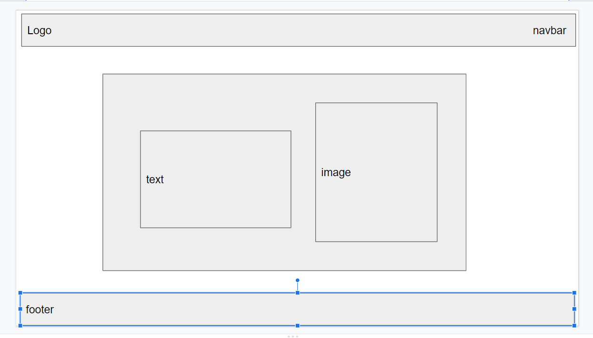

# Portfolio Challenge

  - [ABOUT THE PROJECT](#about-the-project)
  - [SITE LINK](#site-link)
  - [SCREENSHOT](#screenshot)
  - [Mockup](#mockup)
  - [USER STORY](#user-story)
  - [REQUIREMENTS](#requirements)
  - [RESOURCES USED](#resources-used)
  - [HELPFUL LINKS](#helpful-links)
  - [BONUS](#bonus)
  - 
## ABOUT THE PROJECT
This project is to create a unique and proffesional portfolio for showing coding projects. 

## SITE LINK
[Portfolio Link](https://nbrown225.github.io/christinaPortfolio/)

## SCREENSHOT
.png)

## Mockup

## USER STORY
AS AN employer
I WANT to view a potential employee's deployed portfolio of work samples
SO THAT I can review samples of their work and assess whether they're a good candidate for an open position

## REQUIREMENTS
*   GIVEN I need to sample a potential employee's previous work
    - WHEN I load their portfolio
        THEN I am presented with the developer's name, a recent photo or avatar, and links to sections about them, their work, and how to contact them
    - WHEN I click one of the links in the navigation
        THEN the UI scrolls to the corresponding section
    - WHEN I click on the link to the section about their work
        THEN the UI scrolls to a section with titled images of the developer's applications
    - WHEN I am presented with the developer's first application
        THEN that application's image should be larger in size than the others
    - WHEN I click on the images of the applications
    THEN I am taken to that deployed application
    - WHEN I resize the page or view the site on various screens and devices
        THEN I am presented with a responsive layout that adapts to my viewport

## RESOURCES USED
- google slides 
  - For planning layout
- font awesome
  - For icons
- materialize
  - For most of CSS Framework
  
## HELPFUL LINKS
- Navbar - Materialize
https://materializecss.com/navbar.html
- Layout/Grid -
https://materializecss.com/grid.html
- Icons - 
https://www.w3schools.com/icons/
- Clickable Images - 
https://www.w3schools.com/tags/tryit.asp?filename=tryhtml_link_image
- Color and Text Color - 
https://materializecss.com/color.html

## BONUS
* Resource that made my project easier to organize!
GitHub Issues added to GitBash - 
https://cli.github.com/manual/gh_issue_create

